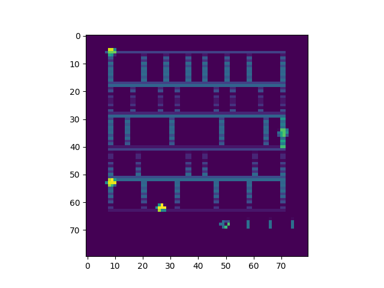
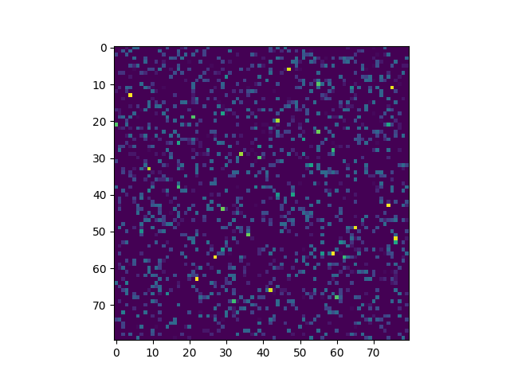

# General Game Player Using Deep Q-Network


## Overview
This project is a practice of Deep Q Learning algorithm and some experiments with the screen adjacency.

I want to repeat the results in [Playing Atari with Deep Reinforcement Learning](https://www.cs.toronto.edu/~vmnih/docs/dqn.pdf)

Modify DQN from [DeepLearningFlappyBird](https://github.com/yenchenlin1994/DeepLearningFlappyBird.git)

Use DQN as a General Game Player, could train all ALE supported games.

Also, it could reassemble the screen in specific random order, to see if the network could be trained as well.


Normal version of AIR RAID screen and its training input image:



Reassembl the screen:



## Installation Dependencies:
* Python 2.7
* TensorFlow 0.7
* pygame
* OpenCV-Python
* Acrade Learning Environment 0.5.0

Need to build ALE and get ale_python_interface/ from [The Arcade Learning Environment](http://www.arcadelearningenvironment.org/downloads/) .

## How to Run?
```
git clone https://github.com/amjltc295/General-Game-Player
cd General-Game-Player
python DQN_randomMapping.py <game name, only names in roms/ are valid> [-r if need to reassemble the screen]
// For example:
python DQN_randomMapping.py Breakout 
// Could run in background and record the output on Linux
python DQN_randomMapping.py Breakout > Breakout_output.txt 2>&1 & 

```


## Deep Q-Network Algorithm

The pseudo-code for the Deep Q Learning algorithm, as given in [1], can be found below:

```
Initialize replay memory D to size N
Initialize action-value function Q with random weights
for episode = 1, M do
    Initialize state s_1
    for t = 1, T do
        With probability ϵ select random action a_t
        otherwise select a_t=max_a  Q(s_t,a; θ_i)
        Execute action a_t in emulator and observe r_t and s_(t+1)
        Store transition (s_t,a_t,r_t,s_(t+1)) in D
        Sample a minibatch of transitions (s_j,a_j,r_j,s_(j+1)) from D
        Set y_j:=
            r_j for terminal s_(j+1)
            r_j+γ*max_(a^' )  Q(s_(j+1),a'; θ_i) for non-terminal s_(j+1)
        Perform a gradient step on (y_j-Q(s_j,a_j; θ_i))^2 with respect to θ
    end for
end for
```


From [DeepLearningFlappyBird](https://github.com/yenchenlin1994/DeepLearningFlappyBird.git)

## References

[1] Mnih Volodymyr, Koray Kavukcuoglu, David Silver, Andrei A. Rusu, Joel Veness, Marc G. Bellemare, Alex Graves, Martin Riedmiller, Andreas K. Fidjeland, Georg Ostrovski, Stig Petersen, Charles Beattie, Amir Sadik, Ioannis Antonoglou, Helen King, Dharshan Kumaran, Daan Wierstra, Shane Legg, and Demis Hassabis. **Human-level Control through Deep Reinforcement Learning**. Nature, 529-33, 2015.

[2] Volodymyr Mnih, Koray Kavukcuoglu, David Silver, Alex Graves, Ioannis Antonoglou, Daan Wierstra, and Martin Riedmiller. **Playing Atari with Deep Reinforcement Learning**. NIPS, Deep Learning workshop

[3] Kevin Chen. **Deep Reinforcement Learning for Flappy Bird** [Report](http://cs229.stanford.edu/proj2015/362_report.pdf) | [Youtube result](https://youtu.be/9WKBzTUsPKc)

[4] Volodymyr Mnih, Koray Kavukcuoglu, David Silver, Alex Graves, Ioannis Antonoglou, Daan Wierstra, Martin Riedmiller. **Playing Atari with Deep Reinforcement Learning**. DeepMind Technologies
, 2013.


## Disclaimer
This work is highly based on the following repos:

1. [sourabhv/FlapPyBird](https://github.com/sourabhv/FlapPyBird)
2. [asrivat1/DeepLearningVideoGames](https://github.com/asrivat1/DeepLearningVideoGames)
3. [yenchenlin/DeepLearningFlappyBird](https://github.com/yenchenlin/DeepLearningFlappyBird)
4. [mgbellemare/Arcade-Learning-Environment](https://github.com/mgbellemare/Arcade-Learning-Environment)

## Author

Ya-Liang Chang [amjltc295](https://github.com/amjltc295/)
